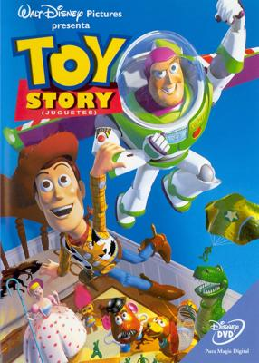
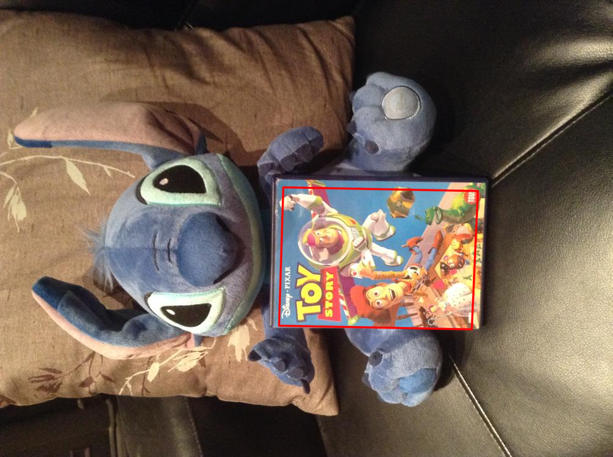

# Introductio
The goal of this project is to recognize the DVD covers in the given image and retrieve from the database.The recognition scheme is based on paper from David et al., Scalable Recognition with a Vocabulary Tree[1].The paper present a recognition scheme that scales efficiently to large number of objects.


# Run
```
cd src
python database.py
```

# Example
Process of Building the database
```
Initial the Database
Loading the images from ../data/DVDcovers, use SIFT for features
Building Vocabulary Tree, with 5 clusters, 5 levels
Building Histgram for each images
Building BoW for each images
Saving the database to data_sift.txt
```
Process of querying 
```
Loading the database
0: scores: -5.548730673820982, image: ../data/DVDcovers/antz.jpg
1: scores: -4.982545807436332, image: ../data/DVDcovers/mystic_river.jpg
2: scores: -4.392313145491339, image: ../data/DVDcovers/o_brother_where_art_thou.jpg
3: scores: -3.5356021232106754, image: ../data/DVDcovers/tarzan.jpg
4: scores: -3.4259076022248047, image: ../data/DVDcovers/grimm_season_two.jpg
5: scores: -3.363552110917791, image: ../data/DVDcovers/aladdin.jpg
6: scores: -3.334311474598981, image: ../data/DVDcovers/shrek2.jpg
7: scores: -3.2717909507672767, image: ../data/DVDcovers/captain_america_winter_soldier.jpg
8: scores: -3.250774872618388, image: ../data/DVDcovers/pomepii.jpg
9: scores: -3.22014862419896, image: ../data/DVDcovers/jumanji.jpg
Running RANSAC... Image: ../data/DVDcovers/antz.jpg Inliers: 44
Running RANSAC... Image: ../data/DVDcovers/mystic_river.jpg Inliers: 47
Running RANSAC... Image: ../data/DVDcovers/o_brother_where_art_thou.jpg Inliers: 10
Running RANSAC... Image: ../data/DVDcovers/tarzan.jpg Inliers: 4
Running RANSAC... Image: ../data/DVDcovers/grimm_season_two.jpg Inliers: 6
Running RANSAC... Image: ../data/DVDcovers/aladdin.jpg Inliers: 4
Running RANSAC... Image: ../data/DVDcovers/shrek2.jpg Inliers: 458
Running RANSAC... Image: ../data/DVDcovers/captain_america_winter_soldier.jpg Inliers: 5
Running RANSAC... Image: ../data/DVDcovers/pomepii.jpg Inliers: 5
Running RANSAC... Image: ../data/DVDcovers/jumanji.jpg Inliers: 6
The best match image: ../data/DVDcovers/shrek2.jpg
Homography: [[ 1.21203793e-03  3.98035708e-03  4.71708624e-02]
 [-2.53473965e-03 -1.37920104e-05  9.98873338e-01]
 [ 2.06584262e-06 -9.21705020e-08  1.79610930e-03]]
```





# Method
## Feature Extractor
I tried both SIFT and ORB, found out the SIFT works better in terms of accuracy whereas the ORB is faster. You can specify both SIFT and ORB in the code.

## Vocabulary Tree
The first step is to build the database use Vocabulary Tree. I first use SIFT to get all the feature descriptors for each the DVD images and then build a Vocabulary Tree of those descriptors. The $k$ defines the branching factor of the tree, and $L$ is the total height of the tree. I use $k = 5, L = 5$. The Vocabulary Tree is a hierarchical clustering for the descriptor, which means instead of having k clusters, k defines the branching factor of the tree. In particular, the descriptor will first be partitioned into k group, then for each group, we continue to do this partition recursively $L$ times. Finally, the clusters in leaf nodes will act as a visual word, which represent a cluster of descriptor. Note that this process can be run under offline setting. 

## Bags of Visual Words
For each images in the dataset, the Bags of Visual Words(BoG) is a descriptor that summarize entire image based on its distribution of visual word occurrences. In my implementation, I keep a dictionary that map a image to it's BoG. This dictionary can be build along the way I build the the Tree. The idea of BoG saves log of time from robustly matching each feature descriptor.

## Querying
When I querying the image, I first calculate the BoG of the querying image. While doing that, I can obtain a list of target image from the database that have at least one common visual word. Then for each target image, I can score each pair between query image and target image to find the top K most similar images.

## Scoring
I use the scoring method that define in the paper. Define two descriptor $q = [q_1, q_2, ..., q_i, ...]$ $d = [d_1, d_2, ..., d_i, ...]$ for query and database image as following
$$ q_i= n_i w_i $$
$$ d_i = m_i w_i $$
where $n_i$ and $m_i$ are the number of descriptor vectors of the query and database image(it can be obtain from the its BoG), $w_i$ is weight defined as following
$$ w_i = \ln{\frac{N}{N_i}} $$
This weight assign a small value to the visual word that frequently appear in the dataset. This weighting scheme helps on reduce the bias for those visual words occurring everywhere.
Since the author states that $L_1$-norm gives better results than the $L_2$-norm, I then calculate the p-norm between $q$ and $d$, where $p=1$ 
$$
s = || q - d ||_p^p = \sum_i |q_i + d_i|^p
$$
Afterwards, I chose the top $K=10$ image that have the small score $s$.

## RANSAC
Since all top K image may have many visual words in common, I use RANSAC(2000 iterations) to calculate the Homography matrix for each pair, and then pick the final image that its Homography obtain the largest number of inliers. 

# References
[1]  David N, and et al, Scalable Recognition with a Vocabulary Tree. 2006